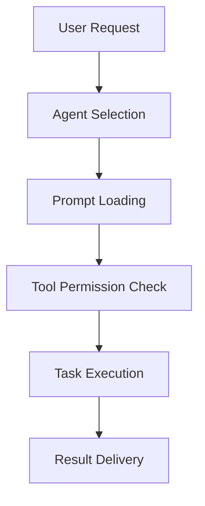

# Mistral Vibe CLI Agent Configuration Guide

## 📋 Overview

This repository contains the custom configuration for Mistral Vibe CLI, designed to provide efficient, specialized agents for various development and business workflows. The configuration is tracked in Git to ensure consistency across environments and enable collaboration.

## 🎯 Purpose

The goal of this configuration is to:

- **Standardize workflows** across projects
- **Improve efficiency** with specialized agents
- **Maintain consistency** in code quality and documentation
- **Enable collaboration** through shared configurations
- **Ensure security** with appropriate tool permissions

## 🗂️ Repository Structure

```
.vibe-config/
├── agents/                  # Custom agent configurations
│   ├── business_analyst_agent.toml  # Business analysis agent
│   ├── code_review_agent.toml      # Code quality agent
│   ├── creative_agent.toml         # Creative problem solving agent
│   ├── cto_agent.toml              # Technical leadership agent
│   ├── documentation_agent.toml    # Documentation agent
│   ├── feature_explorer_agent.toml # Feature exploration agent
│   ├── frontend_developer_agent.toml # Frontend development agent
│   ├── issue_creator_agent.toml    # Issue creation agent
│   ├── learning_agent.toml         # Technical learning agent
│   ├── marketer_agent.toml         # Marketing strategy agent
│   ├── plan_executor_agent.toml    # Plan execution agent
│   ├── product_manager_agent.toml  # Product planning agent
│   ├── saas_designer_agent.toml    # SaaS design agent
│   ├── symfony_developer_agent.toml # Symfony development agent
│   └── website_analyzer_agent.toml # Website analysis agent
├── prompts/                 # Custom prompt templates
│   ├── business_analyst.md  # Business analysis prompts
│   ├── cto_project.md       # CTO project management
│   ├── code_review.md       # Code review workflows
│   ├── create_issue.md      # Issue creation templates
│   ├── create_plan.md       # Project planning
│   ├── creative_agent.md    # Creative problem solving
│   ├── document.md          # Documentation generation
│   ├── execute_plan.md      # Plan execution
│   ├── explore_feature.md   # Feature exploration
│   ├── frontend-developer.md # Frontend development
│   ├── learning_opportunity.md # Learning analysis
│   ├── marketer.md          # Marketing strategy
│   ├── saas-designer.md     # SaaS design patterns
│   └── symfony-developer.md # Symfony development
├── config.toml              # Main configuration with commands
├── agent.md                 # This documentation
├── commands.md              # Custom commands reference
└── instructions.md          # User instructions
```

## 🤖 Agent Architecture

### Core Components

1. **Agents** - Specialized configurations in `agents/*.toml`
2. **Prompts** - Role-specific instructions in `prompts/*.md`
3. **Commands** - Custom workflow shortcuts
4. **Configuration** - Global settings in `config.toml`

### Agent Lifecycle



## 📁 Existing Agents

### Business Analyst Agent (`agents/business_analyst_agent.toml`)

- **Purpose**: Market analysis, business viability, and opportunity assessment
- **Model**: `devstral-2`
- **System Prompt**: `business_analyst`
- **Tools**: Read-only with extended context for research
- **Use Cases**:
  - Market opportunity analysis
  - Competitive landscape assessment
  - Revenue model proposals
  - Risk and moat evaluation

### Code Review Agent (`agents/code_review_agent.toml`)

- **Purpose**: Comprehensive code quality assurance
- **Model**: `devstral-2`
- **System Prompt**: `code_review`
- **Tools**: Read-only with comprehensive analysis capabilities
- **Use Cases**:
  - Code quality assessment
  - Best practices enforcement
  - Security and performance reviews
  - Architecture compliance checks

### Creative Agent (`agents/creative_agent.toml`)

- **Purpose**: Innovative thinking, idea generation, and creative problem solving
- **Model**: `devstral-2`
- **System Prompt**: `creative_agent`
- **Tools**: Read-only with broad context for inspiration
- **Use Cases**:
  - Idea generation and variation
  - Cross-domain connections
  - Bold alternative proposals
  - Differentiating feature brainstorming

### CTO Agent (`agents/cto_agent.toml`)

- **Purpose**: Technical leadership and architecture decisions
- **Model**: `mistralai/mistral-large-latest`
- **System Prompt**: `cto_project`
- **Tools**: Read-only access, no file modifications
- **Use Cases**:
  - Architecture planning
  - Code review oversight
  - Technical roadmapping
  - Risk assessment

### Documentation Agent (`agents/documentation_agent.toml`)

- **Purpose**: Documentation generation and maintenance
- **Model**: `devstral-small` (cost-effective for documentation)
- **System Prompt**: `document`
- **Tools**: Controlled write access for documentation updates
- **Use Cases**:
  - API documentation generation
  - CHANGELOG updates
  - README maintenance
  - Code change documentation

### Feature Explorer Agent (`agents/feature_explorer_agent.toml`)

- **Purpose**: Exploring new features and understanding requirements
- **Model**: `devstral-2`
- **System Prompt**: `explore_feature`
- **Tools**: Read-only with broad context for analysis
- **Use Cases**:
  - Feature requirement analysis
  - Codebase exploration
  - Dependency identification
  - Clarifying question generation

### Frontend Developer Agent (`agents/frontend_developer_agent.toml`)

- **Purpose**: Modern frontend development with TanStack and React
- **Model**: `devstral-2`
- **System Prompt**: `frontend-developer`
- **Tools**: Write access for frontend implementation
- **Use Cases**:
  - React component development
  - TanStack ecosystem implementation
  - TypeScript frontend architecture
  - UI/UX implementation

### Issue Creator Agent (`agents/issue_creator_agent.toml`)

- **Purpose**: Creating structured, actionable issues and bug reports
- **Model**: `devstral-small`
- **System Prompt**: `create_issue`
- **Tools**: Read-only with focused context
- **Use Cases**:
  - Bug report creation
  - Feature request documentation
  - Improvement suggestion capture
  - Issue prioritization

### Learning Agent (`agents/learning_agent.toml`)

- **Purpose**: Technical education and concept explanation
- **Model**: `devstral-2`
- **System Prompt**: `learning_opportunity`
- **Tools**: Read-only with broad context
- **Use Cases**:
  - Technical concept explanation
  - Multi-level learning (basic to advanced)
  - Practical application guidance
  - Hands-on learning support

### Marketer Agent (`agents/marketer_agent.toml`)

- **Purpose**: Positioning, messaging, and go-to-market strategies
- **Model**: `devstral-2`
- **System Prompt**: `marketer`
- **Tools**: Read-only with market research context
- **Use Cases**:
  - Brand positioning development
  - Target audience profiling
  - Go-to-market strategy planning
  - Marketing narrative creation

### Plan Executor Agent (`agents/plan_executor_agent.toml`)

- **Purpose**: Precise implementation of predefined plans
- **Model**: `devstral-2`
- **System Prompt**: `execute_plan`
- **Tools**: Controlled write access for implementation
- **Use Cases**:
  - Plan step-by-step execution
  - Code implementation
  - Progress tracking and updating
  - Modular code development

### Product Manager Agent (`agents/product_manager_agent.toml`)

- **Purpose**: Feature planning, roadmapping, and product strategy
- **Model**: `devstral-2`
- **System Prompt**: `create_plan`
- **Tools**: Read-only with extended project context
- **Use Cases**:
  - Feature implementation planning
  - Roadmap creation
  - Task breakdown and prioritization
  - Progress tracking

### SaaS Designer Agent (`agents/saas_designer_agent.toml`)

- **Purpose**: SaaS UI/UX design with React and Tailwind CSS
- **Model**: `devstral-2`
- **System Prompt**: `saas-designer`
- **Tools**: Write access for design documentation
- **Use Cases**:
  - SaaS dashboard design
  - Design system documentation
  - UI component architecture
  - Visual design patterns

### Symfony Developer Agent (`agents/symfony_developer_agent.toml`)

- **Purpose**: Symfony PHP framework development
- **Model**: `devstral-2`
- **System Prompt**: `symfony-developer`
- **Tools**: Write access for backend development
- **Use Cases**:
  - Symfony application development
  - PHP backend architecture
  - API development
  - Database integration

### Website Analyzer Agent (`agents/website_analyzer_agent.toml`)

- **Purpose**: Comprehensive website analysis and optimization
- **Model**: `devstral-2`
- **System Prompt**: `website-analyzer`
- **Tools**: Read-only with broad analysis context
- **Use Cases**:
  - Website performance analysis
  - SEO optimization recommendations
  - User experience evaluation
  - Technical audit

## 🚀 Creating New Agents

### Agent Configuration Template

```toml
# agents/[agent_name].toml

# Required settings
active_model = "model-alias-or-name"
system_prompt_id = "prompt-filename-without-extension"

# Optional: Disable specific tools
disabled_tools = ["search_replace", "write_file"]

# Tool permission overrides
[tools.read_file]
permission = "always"  # or "ask" or "never"

[tools.bash]
permission = "ask"
allowlist = ["git", "ls", "cat"]

[tools.grep]
permission = "always"
```

### Recommended Agent Types

| Agent Type | Purpose | Recommended Model |
|------------|---------|-------------------|
| **Product Manager** | Feature prioritization, roadmapping | `devstral-2` |
| **Code Review** | Quality assurance, best practices | `devstral-2` |
| **Documentation** | API docs, README generation | `devstral-small` |
| **Security** | Vulnerability scanning, compliance | `devstral-2` |
| **DevOps** | Deployment, infrastructure | `devstral-2` |
| **Data Analyst** | Data processing, insights | `devstral-2` |
| **UX Designer** | Interface design, user flows | `devstral-small` |

### Agent Creation Process

1. **Identify Need**: Determine the specific workflow gap
2. **Choose Prompt**: Select or create an appropriate prompt template
3. **Configure Tools**: Set appropriate permissions
4. **Select Model**: Choose based on complexity and cost
5. **Test**: Validate with sample tasks
6. **Document**: Add to this guide

## 🔧 Configuration Best Practices

### Model Selection

- **`devstral-2`**: Complex reasoning, architecture, strategy
- **`devstral-small`**: Simple tasks, documentation, formatting
- **`local`**: Offline tasks, privacy-sensitive work

### Tool Permissions

| Permission | Use Case |
|------------|----------|
| `always` | Safe, read-only operations |
| `ask` | Potentially destructive operations |
| `never` | High-risk operations |

### Security Considerations

- **Disable write access** for analysis-only agents
- **Restrict bash commands** with allowlists
- **Use read-only mode** for code review agents
- **Limit file access** to project directories

## 📝 Custom Commands

### Command Structure

```toml
# In config.toml
[[commands]]
name = "command-name"          # Short, memorable name
description = "What it does"   # Clear description
agent = "agent-filename"       # Agent config file (without .toml)
prompt = "Prompt template"     # Template with {input} placeholder
```

### Available Commands

Your configuration now includes **15 custom commands** organized into categories:

#### 📈 Business & Strategy Commands
- `analyze` - Business opportunity analysis (Business Analyst Agent)
- `market` - Marketing strategy development (Marketer Agent)
- `plan` - Implementation planning (Product Manager Agent)

#### 💻 Development & Engineering Commands
- `review` - Comprehensive code review (Code Review Agent)
- `frontend` - Frontend development (Frontend Developer Agent)
- `backend` - Symfony backend development (Symfony Developer Agent)
- `execute` - Plan execution (Plan Executor Agent)
- `arch` - Technical architecture (CTO Agent)

#### 🎨 Creative & Design Commands
- `brainstorm` - Creative idea generation (Creative Agent)
- `design` - SaaS UI/UX design (SaaS Designer Agent)

#### 📚 Documentation & Issue Management
- `doc` - Documentation generation (Documentation Agent)
- `issue` - Issue creation (Issue Creator Agent)

#### 🔍 Learning & Exploration Commands
- `learn` - Technical concept explanation (Learning Agent)
- `explore` - Feature requirements exploration (Feature Explorer Agent)

#### 🌐 Analysis Commands
- `analyze-site` - Website performance analysis (Website Analyzer Agent)

### Command Categories

```toml
[command_categories]
business = ["analyze", "market", "plan"]
development = ["review", "frontend", "backend", "execute", "arch"]
creative = ["brainstorm", "design"]
documentation = ["doc", "issue"]
learning = ["learn", "explore"]
```

### Usage Examples

```bash
# Business analysis
vibe analyze "AI-powered observability platform"

# Code review
vibe review "auth_service.py"

# Creative brainstorming
vibe brainstorm "Developer productivity features"

# Documentation generation
vibe doc "Notification API endpoints"

# Feature exploration
vibe explore "Real-time collaboration requirements"
```

### Complete Command Reference

For detailed information about all commands, including usage examples and expected outputs, see the [Custom Commands Reference](commands.md).

## 🔄 Workflow Integration

### Common Workflows

1. **Feature Development**
   ```bash
   # Analyze business opportunity
   vibe analyze "Real-time collaboration feature for developers"
   
   # Create implementation plan
   vibe plan "Real-time collaboration feature"
   
   # Explore technical requirements
   vibe explore "Real-time collaboration requirements"
   
   # Implement backend
   vibe backend "Real-time collaboration API"
   
   # Implement frontend
   vibe frontend "Real-time collaboration UI components"
   
   # Review implementation
   vibe review "collaboration_service.py"
   
   # Update documentation
   vibe doc "Real-time collaboration API documentation"
   ```

2. **Code Review Process**
   ```bash
   # Create detailed issue
   vibe issue "Login fails intermittently on Safari browsers"
   
   # Explore the problem
   vibe explore "Login failure on Safari issue"
   
   # Review relevant code
   vibe review "auth_service.py login method"
   
   # Update documentation if needed
   vibe doc "Update browser compatibility notes"
   ```

3. **Product Strategy Workflow**
   ```bash
   # Analyze market opportunity
   vibe analyze "AI-powered observability platform for startups"
   
   # Brainstorm innovative features
   vibe brainstorm "Differentiating features for observability platform"
   
   # Create marketing strategy
   vibe market "AI observability platform launch"
   
   # Develop technical architecture
   vibe arch "Scalable observability platform architecture"
   ```

4. **Learning & Development**
   ```bash
   # Learn new technical concepts
   vibe learn "React Server Components and their benefits"
   
   # Explore feature requirements
   vibe explore "Real-time collaboration feature requirements"
   
   # Design UI/UX components
   vibe design "Analytics dashboard with data visualization"
   ```

## 🛠️ Maintenance

### Updating Agents

1. **Modify Configuration**: Edit the `.toml` file
2. **Test Changes**: Validate with sample inputs
3. **Update Documentation**: Reflect changes here
4. **Commit Changes**: Version control for rollback

### Adding New Prompts

1. **Create Prompt File**: Add to `prompts/` directory
2. **Reference in Agent**: Update `system_prompt_id`
3. **Test Agent**: Ensure prompt works as expected
4. **Document**: Add to prompt inventory

## 🚨 Troubleshooting

### Common Issues

| Issue | Solution |
|-------|----------|
| Agent not found | Check filename matches reference |
| Permission denied | Review tool permissions in config |
| Prompt not loading | Verify `system_prompt_id` matches filename |
| Model not available | Check `config.toml` model definitions |
| Tool timeout | Adjust timeout settings |

### Debugging Tips

```bash
# Check current configuration
vibe config show

# List available agents
vibe agent list

# Test specific agent
vibe [agent_name] "test prompt"

# View logs
cat ~/.vibe/logs/session/*.log
```

## 📚 Resources

### Official Documentation

- [Mistral Vibe CLI Docs](https://docs.mistral.ai/vibe)
- [TOML Configuration Guide](https://toml.io)
- [Prompt Engineering Best Practices](https://learn.microsoft.com/en-us/azure/ai-services/openai/concepts/advanced-prompt-engineering)

### Community Resources

- [Mistral AI Community](https://community.mistral.ai)
- [Vibe CLI GitHub](https://github.com/mistralai/vibe-cli)

## 🎓 Learning & Improvement

### Performance Optimization

- **Cache frequent queries** to reduce API calls
- **Batch similar tasks** for efficiency
- **Use appropriate models** for task complexity
- **Limit context size** for better response times

### Continuous Improvement

1. **Review agent performance** monthly
2. **Update prompts** based on usage patterns
3. **Add new agents** for emerging needs
4. **Optimize configurations** for cost/performance

## 📝 Changelog

### [Unreleased]

- Initial agent.md documentation created
- Repository structure documented
- Agent creation guidelines established

### Future Enhancements

- Agent performance metrics tracking
- Command usage analytics
- Automated agent testing framework
- Configuration validation scripts

## 🤝 Contributing

### How to Contribute

1. **Fork the repository**
2. **Create a feature branch**
3. **Make your changes**
4. **Test thoroughly**
5. **Submit a pull request**

### Contribution Guidelines

- Follow existing code style
- Document all changes
- Include test cases
- Update this documentation
- Keep changes focused

## 📜 License

This configuration is proprietary and for internal use only. Do not distribute without permission.

## 📞 Support

For issues with this configuration:
- Check the troubleshooting section
- Review recent changes
- Consult the official documentation
- Contact repository maintainers

For Mistral Vibe CLI issues:
- [GitHub Issues](https://github.com/mistralai/vibe-cli/issues)
- [Mistral Support](https://mistral.ai/support)

---

*Last updated: 2024* 🚀